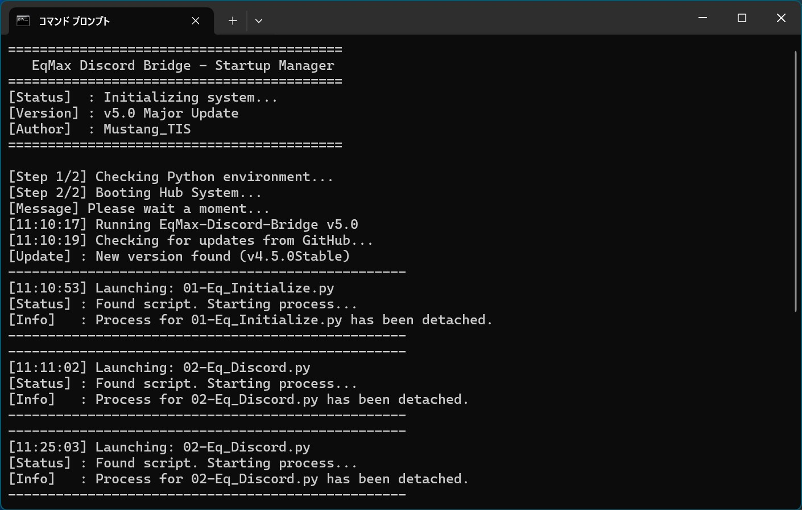

# EqMax-Discord-Bridge v5.0

<b>地震監視ソフト「EqMAX」の通知を、美しく、確実に Discord へ届ける統合管理システム</b>

> [!IMPORTANT]
> ## 📥 最新版のダウンロード (v5.0)
> 
> 
> ### **[🚀 EqMax-Discord-Bridge-v5.0.zip を今すぐダウンロード](https://www.google.com/search?q=https://github.com/MustangTIS/EqMax-Discord-Bridge/releases/download/v5.0/EqMax-Discord-Bridge-v5.0.zip)**
> 
> 
> ※ 上記リンクをクリックすると、すぐに本体のZIPファイルがダウンロードされます。

---

## 📸 動作イメージ

<i>▲ v5.0 統合管理ハブとログを並べたメインデスクトップ</i>

<i>▲ 実際に Discord へ届くリッチな地震通知イメージ</i>

---

## 🎨 v5.0 の主な進化点

* **統合管理ハブ (00-TOP_HUB.py)**: 全てのツールを一つの画面から呼び出し可能。
* **インテリジェンス・ログ**: 起動状況や時刻をプロンプトに詳細出力し、動作状況を可視化。
* **自動更新確認システム**: 起動時に GitHub API を通じて最新リリースの有無を自動チェック。
* **初期設定プリセット**: 用途に合わせた2つの構成テンプレート（Full/Server）を導入。

## 🛠️ 収録ツール一覧

1. **EqMAX 初期設定パッチ**: レイアウト固定、キャプチャ設定、疑似認証を自動適用。
2. **Discord 連携実装**: 最大5つのWebhookを同時管理。
3. **EqMAX 初期化処理**: 困った時のリセット機能。ショートカット削除は手動で行う安全仕様。
4. **メンテナンスツール**: 画像掃除（Cleaner）や、メモリリーク対策の監視（Watchdog）を同梱。

## 🚀 クイックスタート

1. ダウンロードした **`EqMax-Discord-Bridge-v5.0.zip`** を展開します。
2. ルート直下の **`EqMax-Discord-Bridge.bat`** を実行してください。
3. 立ち上がったハブ画面の指示に従ってセットアップを進めます。

> [!IMPORTANT]
> **アイコンの設定について**
> ショートカットを作成したい場合は、`Assets/eq-dis.ico` を指定して適用してください。

## 🖼️ 各種操作画面

### ■ メイン・ハブ & プロンプト

| 統合管理ハブ (GUI) | リアルタイムログ (Prompt) |
| --- | --- |
|  |  |

### ■ 各種設定

| 初期設定パッチ | Discord 連携実装 |
| --- | --- |
|  |  |

### ■ メンテナンス & リセット

| ログ・画像掃除 | 動作監視 (Watchdog) | 初期化処理 |
| --- | --- | --- |
|  |  |  |

---

**© 2026 Mustang_TIS**
