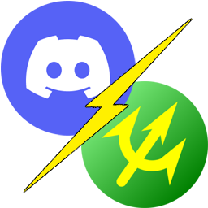
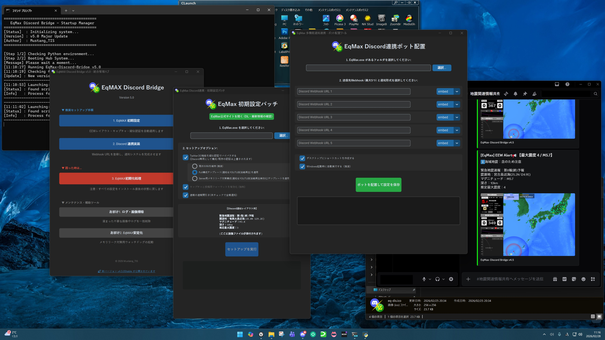
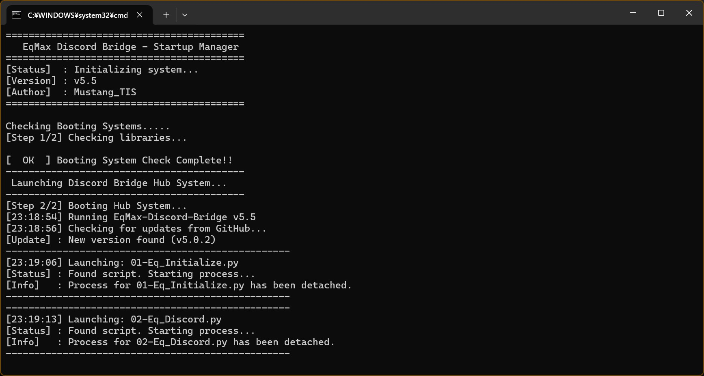
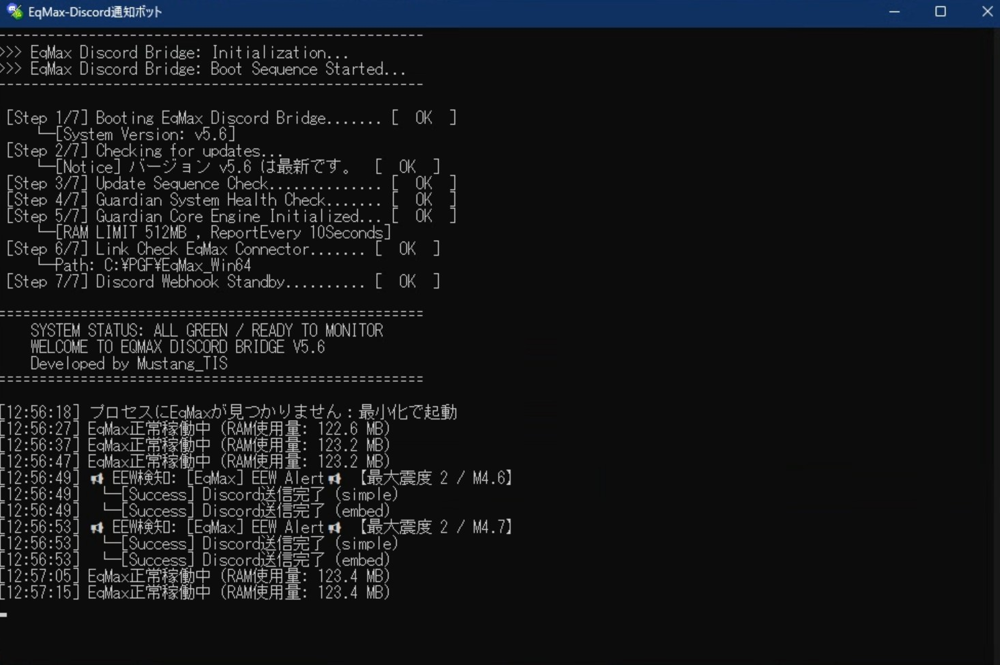
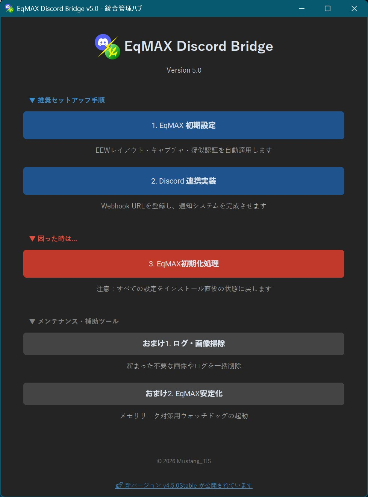
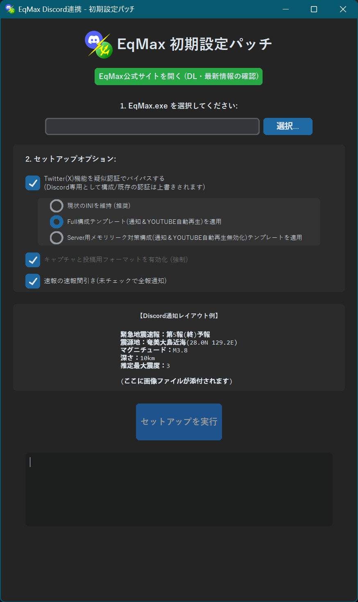
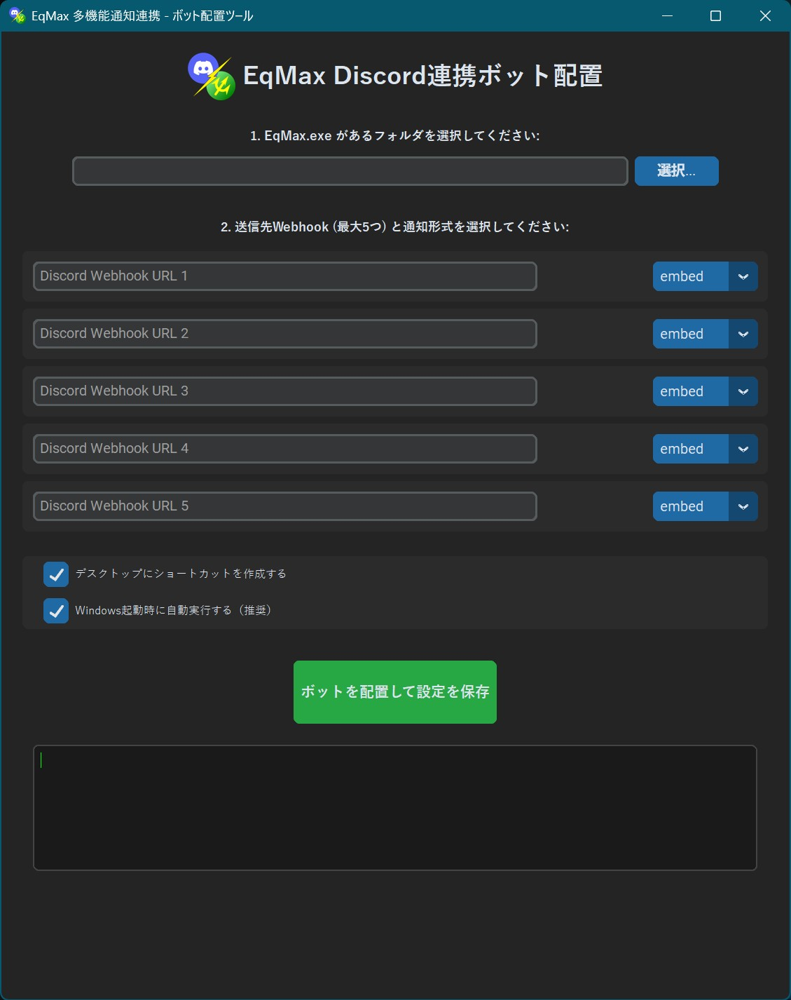
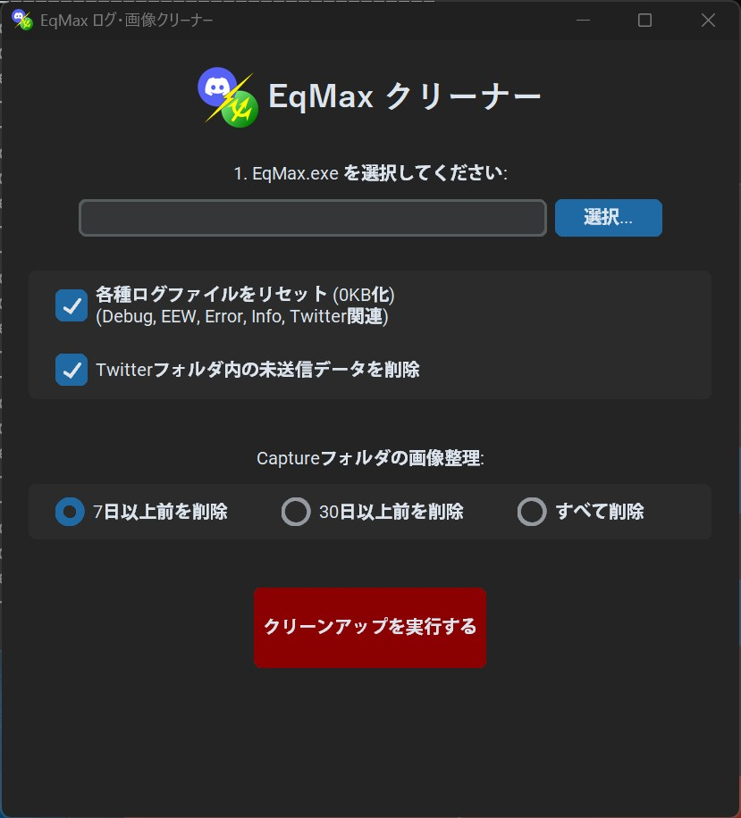
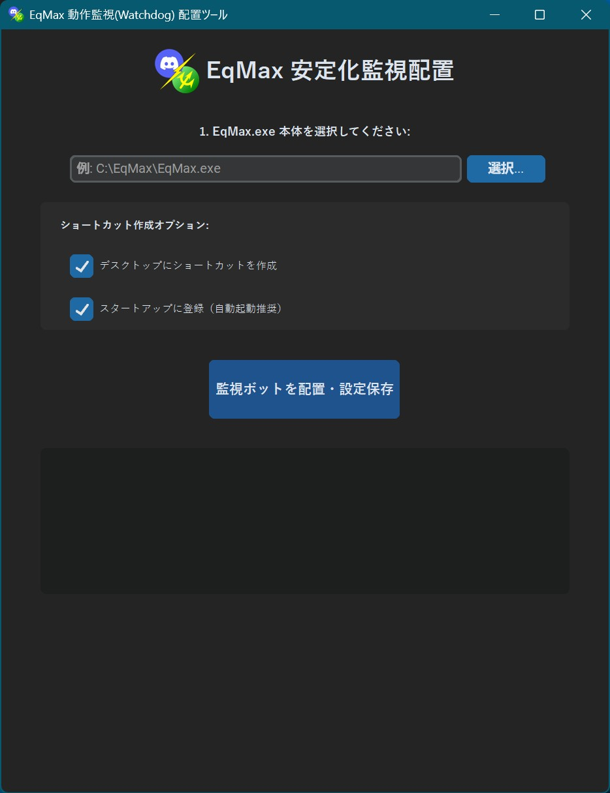
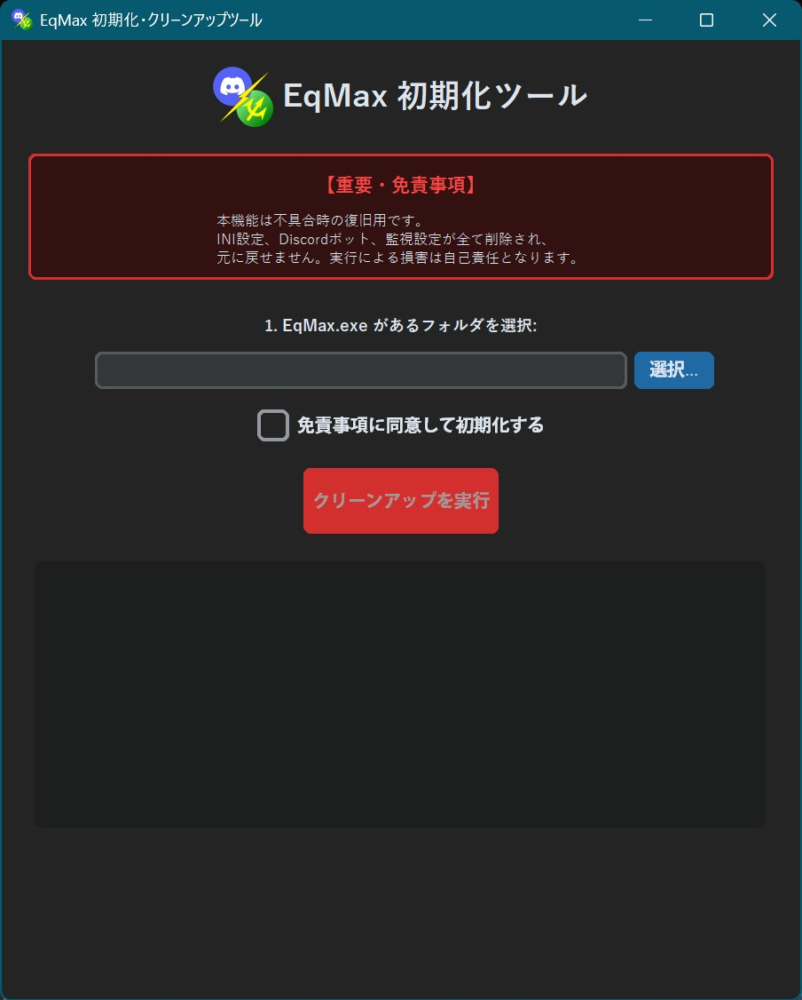

# EqMax-Discord-Bridge v6.0.0 (Emergency Update)

  

  <b>「静かなる守護者（The Silent Guardian）」 — 通信の完全分離と、究極の安定性へ。</b>

> [!IMPORTANT]
> **最新版パッケージ (ZIP) を直接ダウンロード**
> 

>    
>   <a href="https://github.com/MustangTIS/EqMax-Discord-Bridge/releases/download/v6.0.0/EqMax-Discord-Bridge-v6.0.0.zip">
>     
>   </a>
> 

---

Developer: MustangTIS

### ■ メイン・デスクトップ

  

  <i>▲ 統合管理ハブ展開イメージ</i>

---

🚀 v6.0.0 の主な進化点：Twitter(X)通信の完全分離 

* **Twitter(X)機能のデッドロック回避（DummyPost Mode）**
  EqMax内部の通信フラグ `TwitterDummyPost=1` を強制適用。通信の直前で処理を離脱（exit）させることで、**CloudflareによるIPブロックやブラウザのフリーズを100%根絶**しました。

* **初期設定パッチャーの刷新**
  ボタン一つで「ダミー認証の生成」「通信遮断フラグの注入」「キャプチャ設定の最適化」を全自動で行います。専門知識なしで「Discord専用機」への変身が完了します。

* **インテリジェント・ブートシーケンスの深化**
  起動プロセス **Step 1/7 ～ 7/7** を可視化。ネットワークの火種を物理的に消し去ったことで、表示される **`ALL GREEN`** は文字通り「一切の不安がない状態」を意味します。

* **監視エンジンの継続進化 (Private Bytes 監視)**
  アプリが確保している全領域を示す **Private Bytes** の監視を継承。物理メモリでは検知しきれなかった潜在的なメモリ肥大化を確実にキャッチし、対処します。

* **「ログ掠め取り」によるDiscord連携の維持**
  通信は遮断しつつも、送信予定の本文は `Twitter.log` へ確実に書き出す特殊シーケンスを確立。これにより、**公式APIを一切介さずに、従来通りのDiscord通知を実現**しました。 

---

🛠️ 収録ツール一覧 

1. **EqMAX 初期設定パッチ (v6.0.0仕様)**
   レイアウト固定、キャプチャ設定に加え、**Twitterの物理通信遮断**を自動適用。

2. **Discord 連携実装 / Guardian (v6.0.0)**
   最大5つのWebhookを管理。Private Bytes監視エンジンを標準搭載し、長期間の無人運用を支えます。

3. **メンテナンスツール (Cleaner / Watchdog)**
   肥大化する画像・ログの自動掃除や、単体動作に特化した監視ボットを完備しています。

---

### 💻 起動シーケンス (Startup Manager)

本システムでは、**「設定用の管理ハブ」と「実行用の通知ボット」**それぞれに、安定動作を支えるためのインテリジェントな起動シーケンスを搭載しています。

■ 統合管理ハブ (Hub System)
ツールの司令塔となるハブコンソールです。起動時にランタイム環境とアップデートの有無を即座に判定します。

  

  <i>▲ 統合管理ハブ：環境チェックとアップデート照会を自動実行</i>

■ 通知ボット：インテリジェント・ブートシーケンス
通知ボットの実行時には、より厳密な Step 1/7 ～ 7/7 の診断シーケンスが走ります。

  

  <i>▲ 通知ボット：7段階の診断を経て「ALL GREEN」の状態へ</i>

【診断ステップの詳細】
Step 1-3: システムバージョン、GitHub連携、アップデートの整合性を確認。

Step 4-5: Guardianエンジンの健全性と、Private Bytes監視モードの初期化。

Step 6-7: EqMax本体とのリンク、およびDiscord Webhookのスタンバイを最終確認。

---

🚀 クイックスタート 

1. 上記の **[最新版 v6.0.0 をダウンロード]** ボタンから最新のリリースを取得して展開します。

2. フォルダ内の **`EqMax-Discord-Bridge.bat`** を実行してください。

3. **Step 1/7 ～ 7/7** の自動チェックが完了し、ハブが立ち上がったら指示に従いセットアップを進めます。

> [!TIP]
> **トラブル時の「セーフモード」**
> もし黒い画面がすぐ閉じてしまう場合は、作成された「(セーフモード)」ショートカット、または各フォルダ内のバッチファイルを直接実行して自己診断を行ってください。

---
## 🖼️ 設定画面ギャラリー

### ■ メイン操作・設定

| 統合管理ハブ (v5.5) | 初期設定パッチ | Discord 連携実装 |
| --- | --- | --- |
|  |  |  |
| アプリの開始画面 | EqMaxの設定を自動最適化 | Discord連携の管理 |

### ■ メンテナンス・補助ツール

| ログ・画像掃除 | 動作監視 (Watchdog) | 初期化処理 |
| --- | --- | --- |
|  |  |  |
| 不要ファイルの自動削除 | RAM超過時の自動復旧 | 困った時の設定初期化ツール |

---

制作者：MustangTIS

GitHub: [https://github.com/MustangTIS/EqMax-Discord-Bridge](https://github.com/MustangTIS/EqMax-Discord-Bridge)

---

### 🧐 修正箇所

* **ZIPリンク**: `
` や `<a>` タグの複雑なネストを避け、Markdown標準のリンク記法に変更しました。これで確実にクリック可能になります。
* **画像ギャラリー**: テーブル内の画像サイズと改行を再調整し、プレビューで崩れないようにしました。

これで今度こそ、見た目も機能も完璧なはずです。この内容でいかがでしょうか？