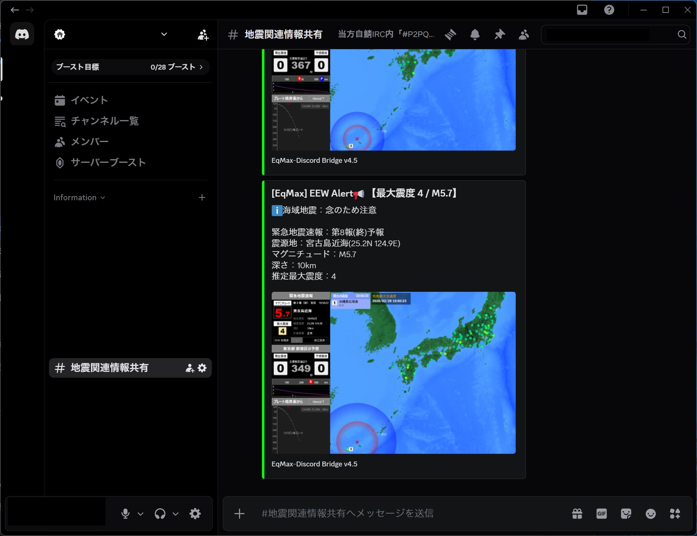

# EqMax-Discord-Bridge v5.5

  

  <b>地震監視ソフト「EqMAX」の通知を、美しく、確実に Discord へ届ける統合管理システム</b>

> [!IMPORTANT]
> **最新版ダウンロード**
>
> <a href="https://github.com/MustangTIS/EqMax-Discord-Bridge/releases/download/v5.5/EqMax-Discord-Bridge-v5.5.zip">
>   
> </a>

---

Developer: MustangTIS

📸 動作イメージ

 
<i>▲ v5.5 統合管理ハブと進化した Startup Manager</i>

 
<i>▲ 実際に Discord へ届くリッチな地震通知（海域判定・津波警戒対応）</i>

---

## 🚀 v5.5 の主な進化点
* **インテリジェンス・ランチャー**: Python環境や必須ライブラリを自動チェック。環境構築の手間をゼロにしました。
* **🛰️ GitHub API 連携**: 起動時に最新タグを自動照会。更新がある場合は即座に通知・誘導を行います。
* **📊 安定化監視（Watchdog）の可視化**: 1時間ごとの報告に EqMax のメモリ使用量(MB)を記録。リソース消費を可視化しました。
* **🚨 津波警戒ロジック**: マグニチュードと震源地を解析し、海域地震時に「大津波警戒」等のフラグを自動付与します。

## 🛠️ 収録ツール一覧
1. **EqMAX 初期設定パッチ**: レイアウト固定、キャプチャ設定、疑似認証を自動適用。
2. **Discord 連携実装 (v5.5)**: 最大5つのWebhookを管理。embed / simple スタイル切り替え対応。
3. **メンテナンスツール**: 肥大化する画像・ログの自動掃除（Cleaner）や、メモリリーク対策（Watchdog）を完備。

## 🚀 クイックスタート
1. 上記の **[最新版 v5.5 をダウンロード]** ボタンからZIPを取得して展開します。
2. フォルダ内の **`EqMax-Discord-Bridge.bat`** を実行してください。
3. 準備が整うと統合ハブが立ち上がるので、指示に従いセットアップを進めます。

> [!TIP]
> **アイコンの設定について**
> ショートカットを作成したい場合は、`Assets/eq-dis.ico` を指定して適用してください。

## 🖼️ 設定画面ギャラリー

### ■ メイン・ハブ & 最新プロンプト
| 統合管理ハブ (GUI) | 起動マネージャー (Prompt) |
| :---: | :---: |
|  |  |

### ■ 各種設定
| 初期設定パッチ | Discord 連携実装 |
| :---: | :---: |
|  |  |

### ■ メンテナンス & 監視
| 動作監視 (Watchdog) | ログ・画像掃除 | 初期化処理 |
| :---: | :---: | :---: |
|  |  |  |

---
**© 2026 Mustang_TIS**