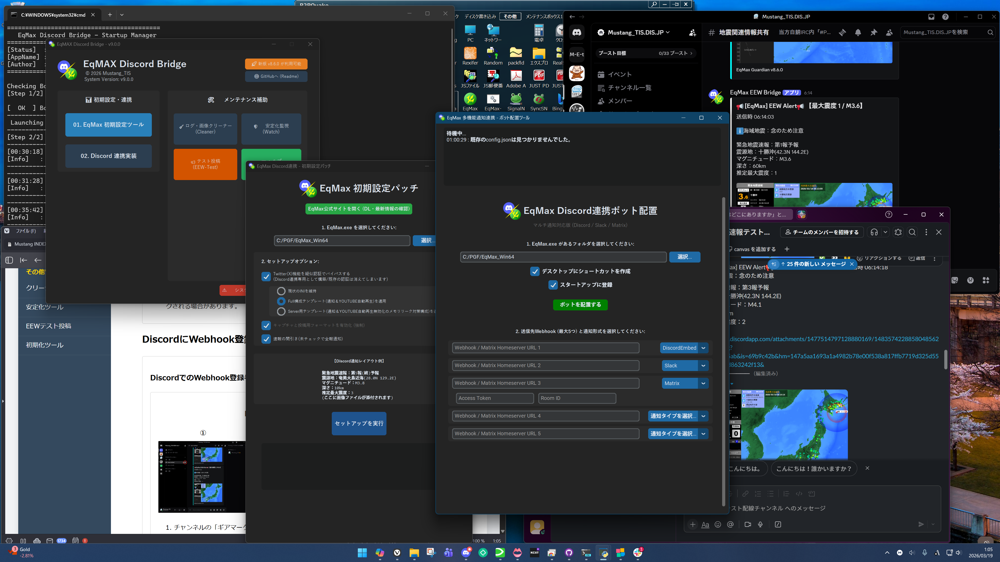
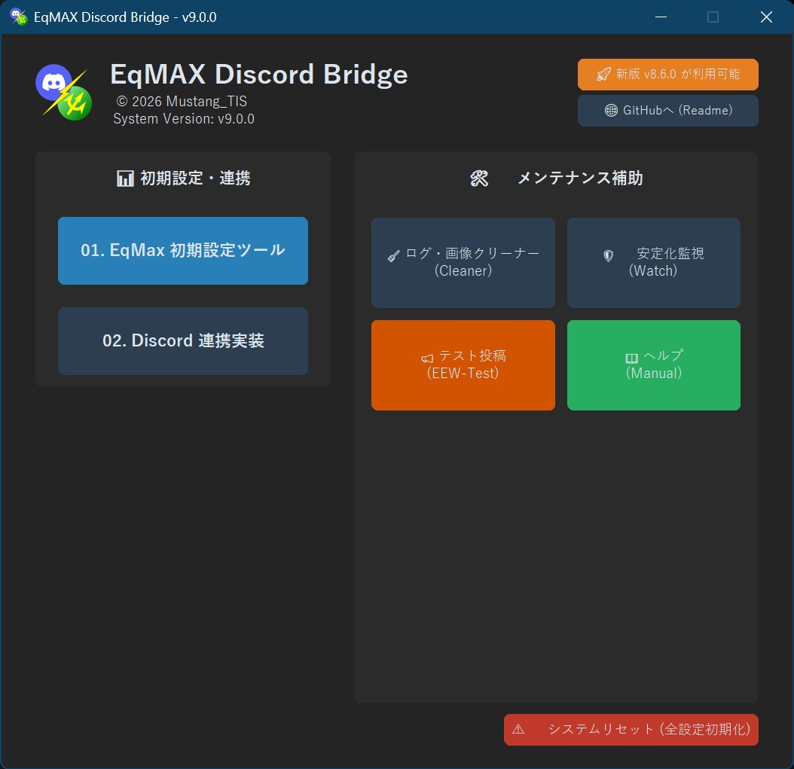
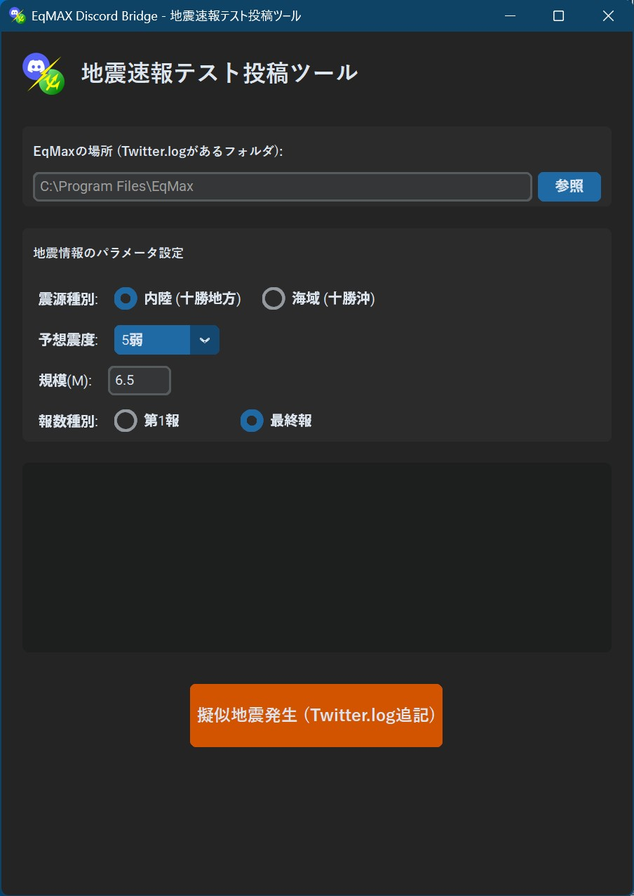
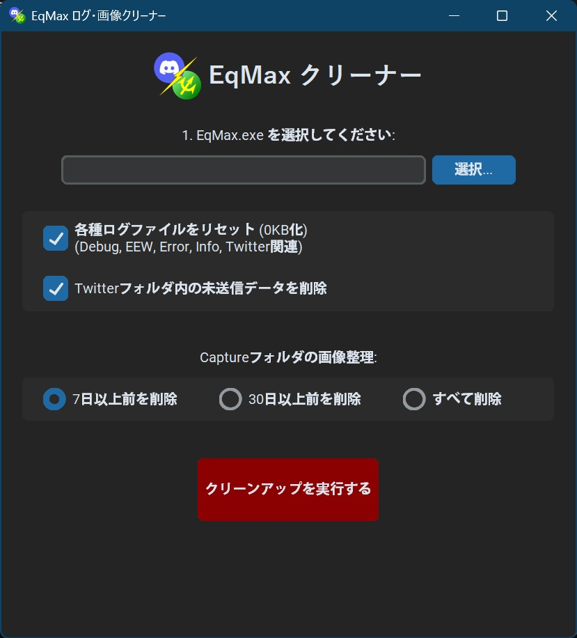

<table>
<tr>
<td rowspan="2" align="center" valign="middle">

</td>
<td align="left">
<h1>EqMax-Discord-Bridge v10.0.0</h1>
<h3>(Confirmed Seismic & Tsunami Warning Implementation)</h3>
</td>
</tr>
<tr>
<td align="left">

<em>「速報と確定情報の両立で、さらに正確な情報を。」 — 待望の確定震度・津波通知を実装。</em>

</td>
</tr>
</table>

【最新版パッケージ (ZIP) を直接ダウンロード】

Developer: MustangTIS

～2026/03/11 — 震災から15年目の節目に寄せて～

東日本大震災から15年。あの日、私たちが痛感したのは「正確な情報の価値」でした。
一秒でも早く届ける「速報（EEW）」、そして揺れた後に状況を冷静に判断するための「確定報」。
この両輪が揃ってこそ、真の防災ツールになると信じ、開発を続けてきました。

今年リリースを開始した本プロジェクトは、ついに大きな到達点である **v10.0.0** へ到達しました。
これまで未実装だった **「確定震度情報」** および **「津波情報」** の自動投稿機能を完全実装。
「揺れる前」から「揺れた後」までをシームレスに繋ぐ、統合型防災通知ハブへと進化を遂げました。

2026/03/30 MustangTIS

---

## 📺 v10.0.0 の核心：『テレビ速報スタイル』フォーマット

本バージョン最大のこだわりは、情報の「見せ方」にあります。
一般的なソフトに多い「地域順」の羅列ではなく、日本のテレビニュース速報でおなじみの **「震度 ＞ 地域 ＞ 市区町村」** の順で構成される独自ロジックを導入しました。

* **直感的な視認性**: 最も強い揺れに見舞われた地域が最上段に並びます。
* **迅速な状況把握**: 緊迫した状況下で、どこを優先的に確認すべきか迷わせません。
* **2000文字制限対応**: 大規模地震時の膨大な情報も、Discordの制限内で適切にハンドリング（切り捨て処理）し、通知不達を根絶します。

## 🚀 主なアップデート内容

### 📢 確定報・津波情報の統合
EEW（速報）の後に発行される詳細な「震源・震度報」と、命を守るための「津波警報・注意報」を自動検知して投稿します。

### 🛠️ 総合テストユニット (O03-EEW-Test) の強化
実際の地震を待たずとも、新実装の「確定報」や「津波警報（赤背景等）」の表示をいつでも検証可能になりました。

### 🎨 内部構造のモジュール化
EEW解析エンジンをメインソースから分離。自宅サーバーでの24時間365日運用における安定性とメンテナンス性をさらに向上させました。

---

💻 動作環境・スペック

開発＆動作確認: Windows 11 / Windows Server 2025
推奨環境: Windows 10/11, Windows Server 2022/2025 (x64専用)
必要ソフト: EqMax (強震モニタ表示ソフト), Python 3.10-3.13

🛠️ 収録ツール紹介

<table width="100%">
<tr>
<td width="33.3%" align="center" valign="top">
 
<strong>総合ハブ (TOP_HUB)</strong> 
<small>全機能へ直感的にアクセス</small>
</td>
<td width="33.3%" align="center" valign="top">
 
<strong>テストユニット (Test)</strong> 
<small>確定報・津波のシミュレート</small>
</td>
<td width="33.3%" align="center" valign="top">
 
<strong>掃除ツール (Cleaner)</strong> 
<small>ログ・画像の自動整理</small>
</td>
</tr>
</table>

⚠️ 免責事項

本ツールの利用により生じた損害について、作者は一切の責任を負いません。防災の際は、必ず気象庁や自治体の公式発表を確認してください。

制作者：MustangTIS
GitHub: https://github.com/MustangTIS/EqMax-Discord-Bridge
