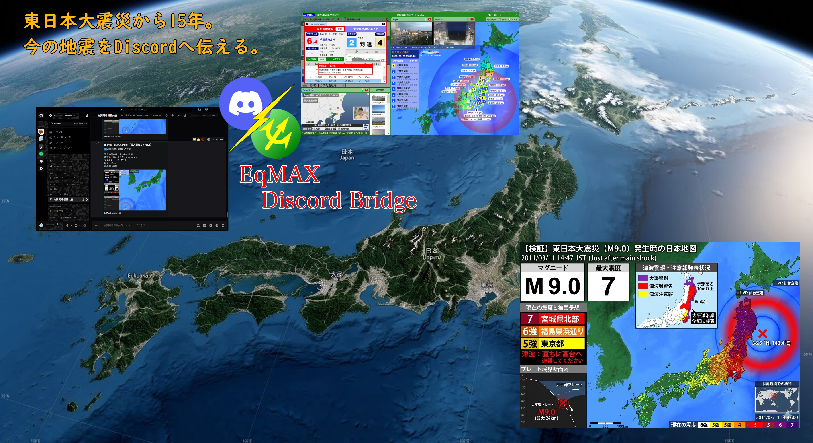

了解いたしました。README.mdをバージョン8.0.0に合わせて更新します。
HTMLヘルプの搭載と、導入難易度の改善を強調しつつ、最新のシステム構成に合わせた内容にします。

---

# EqMax-Discord-Bridge v8.0.0 (Help Complete Update)

---

<b>「運用のすべてを、その手に。」 — 導入からトラブルシューティングまで、完全ガイドの完備。</b>

> **2026/03/11 — 震災から15年目の節目に寄せて**
>
> 東日本大震災から15年が経ちました。あの日の教訓を風化させず、一秒でも早く、一通でも多くの情報を届けること。
> このツールが、これからも皆様の安心を守るための「架け橋」であり続けることを願っています。

> [!IMPORTANT]
> **最新版パッケージ (ZIP) を直接ダウンロード**
>
> 

>   <a href="https://github.com/MustangTIS/EqMax-Discord-Bridge/releases/download/v8.0.0/EqMax-Discord-Bridge_v8.0.0.zip">
>     
>   </a>
> 

---

Developer: MustangTIS

「EqMaxの地震速報を通知したい」。その思いから作り始めたこのツールも、多くの皆様に支えられ、ついに導入から運用トラブル対応までを自己完結できる「完全なシステム」へと進化しました。

v8.0.0 では、これまで難易度が高かった各プラットフォーム（Matrix/Slack）の設定手順を、アプリ内蔵のHTMLヘルプとして完全実装。初心者の方でも迷わず運用を開始できるよう、全ての機能と対応表を網羅しました。

これからの地震情報を認知していただくための「架け橋」として、より確実な情報伝達にお役立てください。

2026/03/10 Mustang_TIS

---

### 🚀 v8.0.0：ヘルプ完備・システム最適化Update

本バージョンでは、運用上の「わからない」を徹底的に排除しました。

* **[Docs] HTMLヘルプシステムの完全実装**
  アプリ内にHTML形式の完全マニュアルを搭載。MatrixやSlackの難解な設定もステップバイステップでガイドします。運用上の注意点をまとめた「Chips（ヒント）」機能も追加。
* **[UX] 総合管理ハブの操作性向上**
  ボタン配置の最適化により、導入からメンテナンスまで迷うことのない直感的なUIへ刷新。
* **[Core] 安定性と信頼性の追求**
  文脈の整理や推奨環境の明文化により、設定ミスを未然に防ぐ運用フローを確立。

---

🛠️ 収録ツール一覧

1. **HTML ヘルプ/マニュアル (New!)**
   全機能・設定手順・トラブル対応表を網羅した運用ガイド。
2. **EqMAX 初期設定パッチ**
   レイアウト固定、通信遮断、疑似認証を自動適用。ワンクリック最適化。
3. **Guardian Hub (通知エンジン)**
   Discord/Slack/Matrix 等、最大5つの送信先を一元管理。
4. **メンテナンスツール (Cleaner / Watchdog)**
   肥大化する画像・ログの自動掃除や、フリーズ検知による自動再起動を完備。
5. **EqMAX 初期化ツール (Reset)**
   導入直後の状態へ復元。

---

💻 設定時デスクトップイメージ (Desktop image)

本システムは、EqMax-Discord-Bridge.batを機動すると、GUI管理ハブから各種項目へアクセスが可能

<i>▲アプリ実行時のイメージ(v5.0時代)</i>

### 💻 v7.0.0から拡張されたDiscord連携システム (Discordbot Installer)

<i>▲あらたにSlackやMatrixへの投稿もサポートした協力なGUI設定画面<i>

---

📘 運用ガイド・ヘルプへのアクセス

本システムは、司令塔となる「管理ハブ」から起動可能です。

p align="center">

<i>▲ 統合管理ハブ：マニュアルへのアクセスおよび環境診断を自動実行</i>

> [!TIP]
> **トラブル時の「セーフモード」**
> もし起動しない場合は、同梱の「(セーフモード)」ショートカットを実行してください。自己診断・自動修復機能が働き、環境を自動で再構築します。

---
### 🖼️ 設定画面ギャラリー

### 🛠️ 収録ツール紹介

各ツールは統合管理ハブから呼び出し可能です。

| 統合管理ハブ (Hub)                       | 初期設定パッチ (Patcher)                       | 監視・通知 (Guardian)                       |
| :----------------------------------------- | :----------------------------------------------- | :-------------------------------------------- |
|  |  |  |
| 全機能の司令塔                           | ワンクリック最適化                             | マルチ通知エンジン                          |

| ログ・画像掃除 (Cleaner)                     | 動作監視 (Watchdog)                           | 初期化ツール (Reset)                                |
| :--------------------------------------------- | :---------------------------------------------- | :---------------------------------------------------- |
|  |  |  |
| 不要ファイルの自動削除                       | RAM超過時の自動復旧                           | 導入直後の状態へ復元                                |

### ⚠️ 免責事項

本ツールの利用により生じた損害について、作者は一切の責任を負いません。また、EqMax本体、及び通知先各社（Discord/Slack/Matrix）は当方とは一切関係ありません。

---

制作者：MustangTIS
GitHub: [https://github.com/MustangTIS/EqMax-Discord-Bridge](https://github.com/MustangTIS/EqMax-Discord-Bridge)

