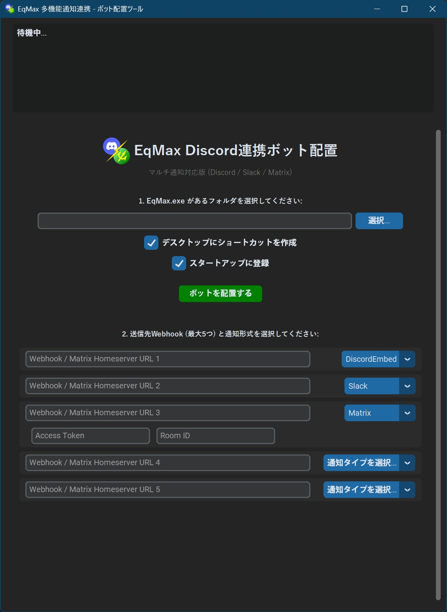
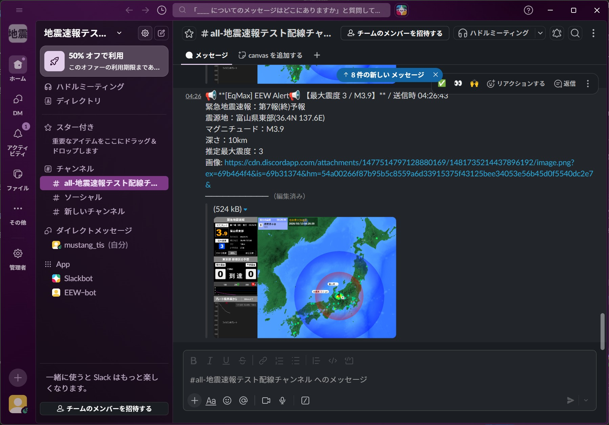
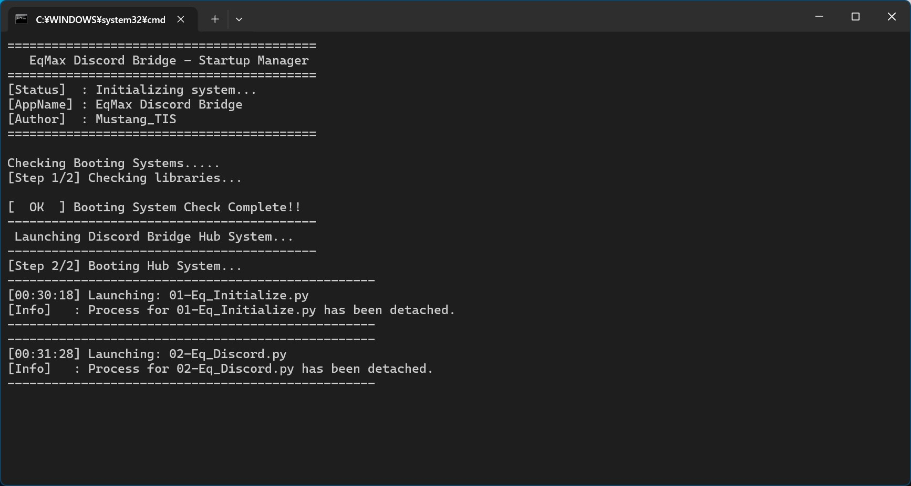
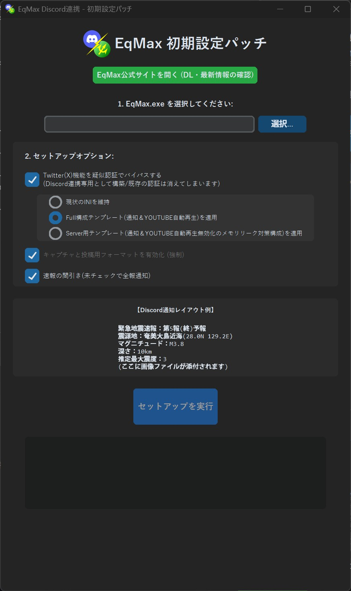
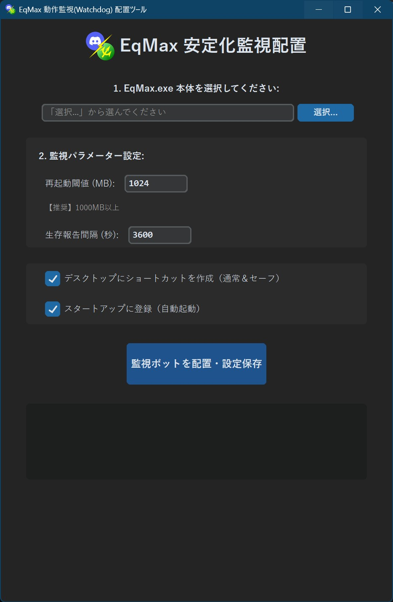
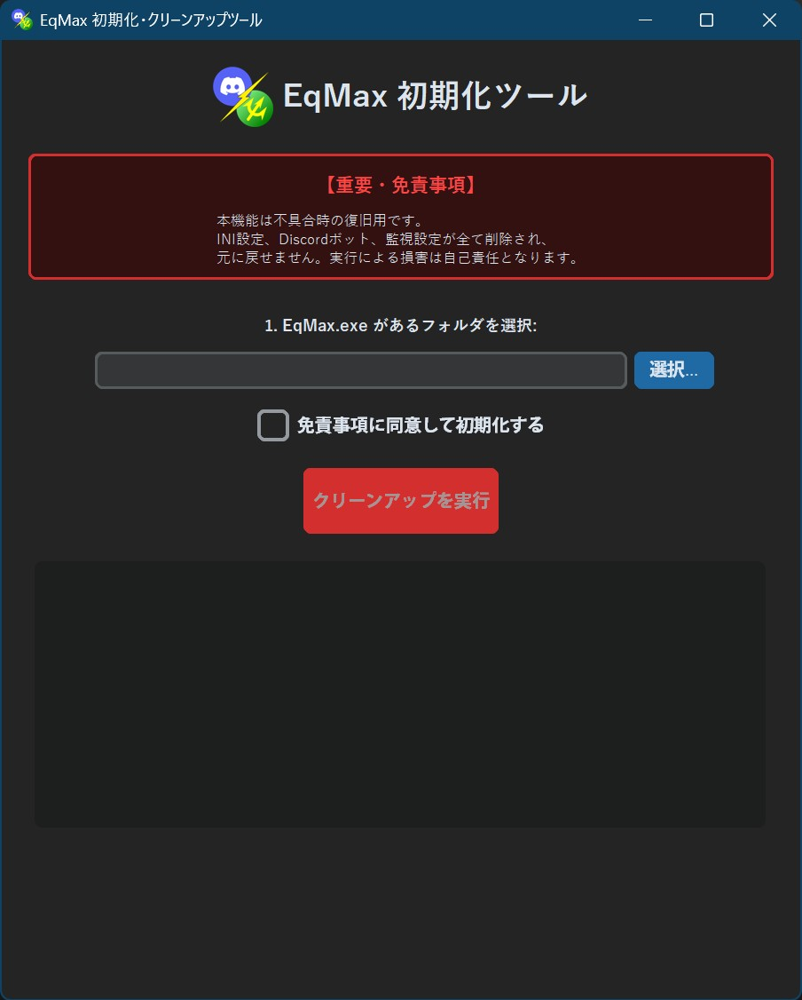

<table>
<tr>
<td rowspan="2" align="center" valign="middle">

</td>
<td align="left">
<h1>EqMax-Discord-Bridge v9.0.0</h1>
<h3>(Major UI & Functional Update)</h3>
</td>
</tr>
<tr>
<td align="left">

<em>「更なる使いやすさと、確実な連携を。」 — 操作系統の刷新と、診断機能の搭載。</em>

</td>
</tr>
</table>

[!IMPORTANT]
最新版パッケージ (ZIP) を直接ダウンロード

Developer: MustangTIS

～2026/03/11 — 震災から15年目の節目に寄せて～

東日本大震災から15年が経ちました。あの日の教訓を風化させず、一秒でも早く、一通でも多くの情報を届けること。
このツールが、これからの皆様の安心を守るための「新たなツール」であり続けることを願っています。

「EqMaxの地震速報をいろんな場所に通知したい」。その思いから作り始めたこのツールも、多くの皆様に支えられ、ついに導入から運用トラブル対応までを自己完結できる「完全なシステム」へと進化しました。

v9.0.0 では、これまで難易度が高かったMatrix/Slackへの画像送信をDiscordを仲介することで実現。構築した連携の動作確認をEEWを待たずに即確認可能な「テストEEW通知」を実装しました。初心者の方でも迷わず運用を開始できるよう、画像付きヘルプマニュアルも完備。高性能なEqMaxをさらに強化する、統合型強化システムへと進化します。

これからの地震情報を認知していただくための「架け橋」として、より確実な情報伝達にお役立てください。

2026/03/19 MustangTIS

🚀 v9.0.0 (Major UI & Functional Update)

[New Feature] EEWテスト投稿機能の搭載
実装が正しく行われているかを確認できる「テスト投稿ボタン」を追加。実際に地震が発生するのを待たずとも、連携が正常に動作するかを即座に検証可能になりました。

※EqMax初期設定ツールに準拠した設定が必要です。

[UX/UI] 総合ハブ(TOP_HUB)のレイアウト刷新
アプリケーション数の増加に伴い、従来の縦一列から「左右2カラム」の配置へ変更。視認性と動線を整理しました。

▲新しい総合ハブ

[Improvement] Discord連携ツールの高度化
設定画面のスクロール対応により操作性を向上。また、設定再適用時に古いプロセスを自動停止し、新しい設定で再起動するシームレスな更新処理を実装。

💡 v8.5.0：画像リバース配信機能の追加

「Discord を、すべての速報のハブへ。」 — 通知網の統合と画像連携の実現。

 

<em>☝Discordへの投稿画像をSlackやMatrixに自動転送可能に</em>

[Feature] Discord 経由 de 画像リバース配信機能
Discordへ投稿されたEEW通知から画像URLを解析・取得し、SlackやMatrixへ自動転送する仕組みを実装。

[Visual] 通知フォーマットの最適化
Slack・Matrixにおける通知表示を「改行区切り」へと変更し、情報の可読性を向上。

🛠️ 収録ツール紹介

各ツールは統合管理ハブから呼び出し可能です。

ハブ・プロンプト

背後でプロセスを集中管理

初期設定パッチ

ワンクリックで最適化

監視・通知

画像転送対応エンジン

ログ・画像掃除

不要ファイルの自動削除

動作監視

24時間365日の安定稼働

初期化ツール

クリーンな状態へ復元

[!TIP]
トラブル時の「セーフモード」
もし起動しない場合は、同梱の「(セーフモード)」ショートカットを実行してください。自己診断・自動修復機能が働き、Python環境などを自動で再構築します。

⚠️ 免責事項

本ツールの利用により生じた損害について、作者は一切の責任を負いません。また、EqMax本体、及び通知先各社（Discord/Slack/Matrix）は当方とは一切関係ありません。

制作者：MustangTIS
GitHub: https://github.com/MustangTIS/EqMax-Discord-Bridge