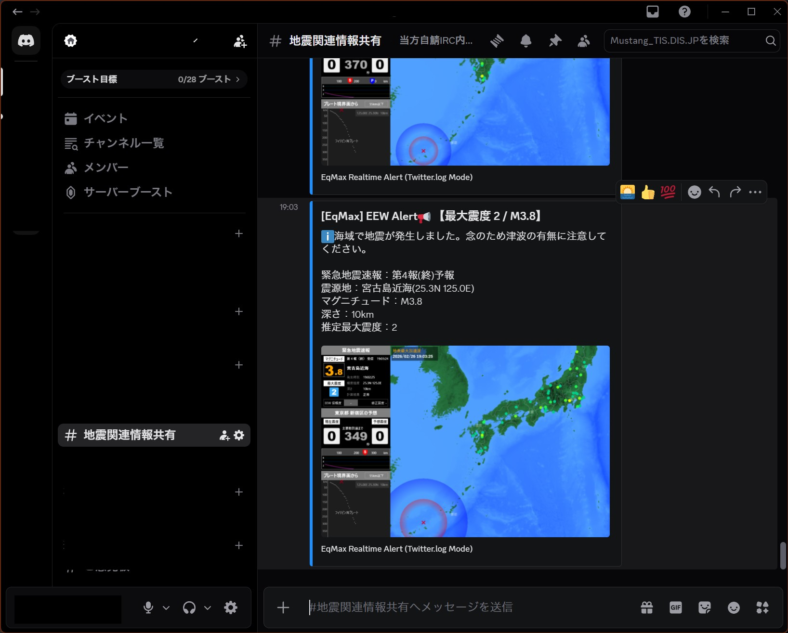
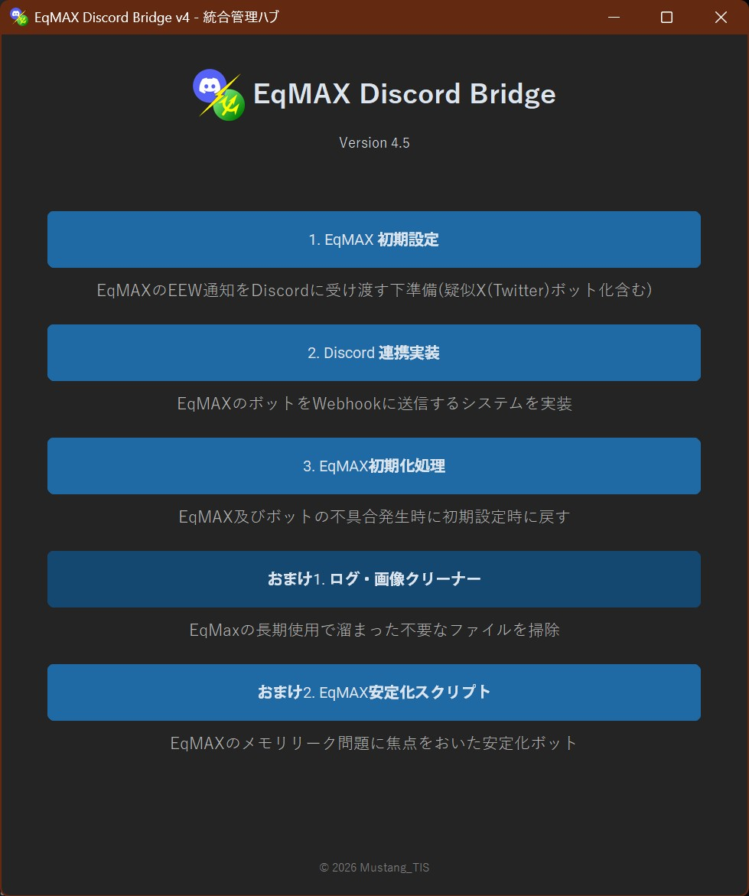
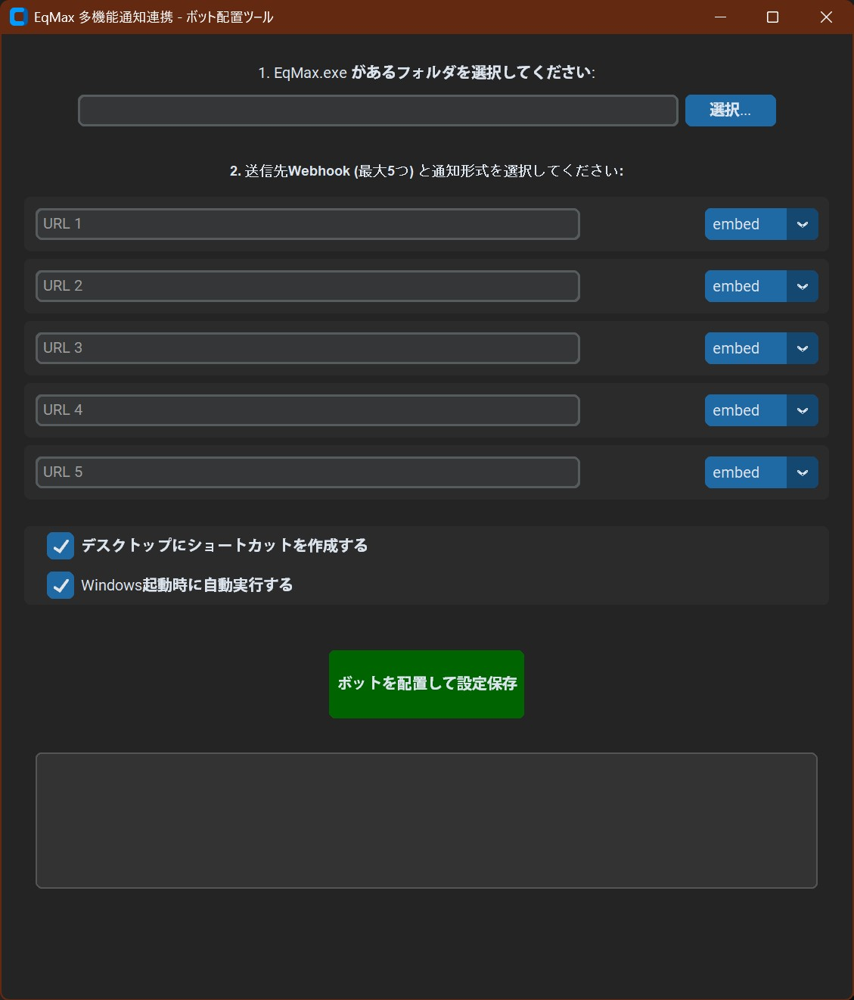
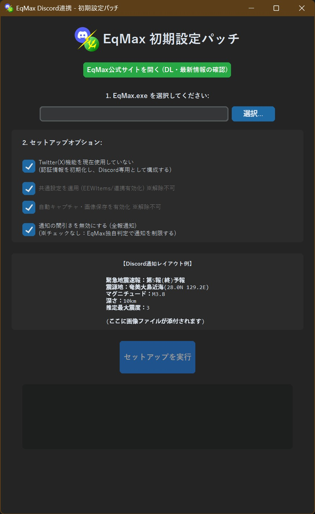

# 📢 EqMax-Discord-Bridge v4.5.0

  
  
  <h3>EqMaxの情報をDiscordへリアルタイム転送</h3>

  

  
※本ツールは非公式のファンプロジェクトです。 DiscordおよびEqMAXの公式とは一切関係ありません。

---

## 📺 スクリーンショット

### ■ 実際の通知イメージ (Discord)
マップ付きのリッチな通知（Embedモード）が自動送信されます。

  

### ■ 操作画面 (GUI)
すべての設定は直感的なGUIから一括管理可能です。

  <table>
    <tr>
      <td><b>統合管理ハブ</b></td>
      <td><b>Webhook・自動起動設定</b></td>
    </tr>
    <tr>
      <td></td>
      <td></td>
    </tr>
    <tr>
      <td><b>EqMax初期設定パッチ</b></td>
      <td><b>構成オプション</b></td>
    </tr>
    <tr>
      <td colspan="2" align="center"></td>
    </tr>
  </table>

---

## 📖 導入ガイド (v4.5 Hub System)

### ■ 動作環境
* **推奨OS**: Windows 10 / 11 / Server 2022 / 2025
* **推奨Python**: **Python 3.13**
  - ※Python 3.14以降はライブラリ未対応のため 3.13 を推奨します。

### ⚠️ 初回実行時の注意
本ツールは未署名ファイルのため、Windows SmartScreen（青い画面）が表示されることがあります。
* **対処法**: 「詳細情報」→「実行」を選択。
* **推奨**: ZIPを解凍する前に、右クリック ＞ プロパティ ＞ **「許可する」または「ブロックの解除」** にチェックを入れてください。

---

## 🛠 各ツールの役割
1. **初期設定パッチ (01-Eq_Initialize)**: EqMaxを「Discord連携モード」へ自動構成。
2. **ボット配置ツール (02-Eq_Discord)**: 最大5件のWebhook登録。見張り番機能内蔵。
3. **初期化・修復ツール (03-Eq_Reset)**: 動作不良時のリセット用。
4. **ログ・画像クリーナー (O01-Eq_Cleaner)**: メンテナンス用。

---

## 🔗 関連リンク・免責事項
* **[EqMax 配布元公式サイト]**: [https://melanion.info/eqmax/](https://melanion.info/eqmax/)
* **免責事項**: 本ツールは個人開発の非公式ツールです。本ツールの使用によって生じた損害について、開発者は一切の責任を負いません。

  Developed by MustangTIS

